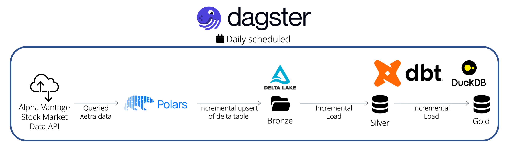

# Local modern data stack

This project demos how to intgrate duckdb and delta lake into dbt orchestrated by Dagster. The stack once per day queries Xetra data from an API and does an incremental load into a medallion architecture. Finally, a simply line chart is created via Plotly. Overview:

## How to run

Simply run `$ uv run dg dev` to launch the dagster webserver.
